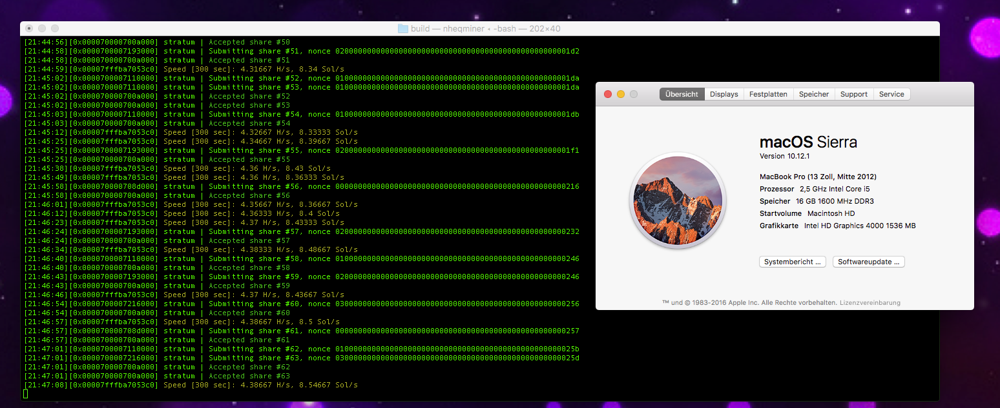

# Nheqminer

Equihash/zcash/zec miner (can be used for pool mining)

**NOTE: Common mistake is to clone this repo without recursive, you need to use --recursive**

```
git clone --recursive https://github.com/justvanbloom/nheqminer
```

**Your build with XENON/XENONCAT will fail otherwise**

# Features



Major things:
- Implemented all fast implementations (tromp and xenoncat with AVX1/AVX2)
- Better support for other platforms

Platforms:
- Linux (tromp, xenoncat support)
- Mac OS X (tromp and xenoncat support)
- Windows (tromp, xenoncat but need tweaking)

# Usage


### nicehash
`nheqminer -l equihash.eu.nicehash.com:3357 -u YourBitcoinAdress.YourWorker -p x -t threadCount`

Example
`nheqminer -l equihash.eu.nicehash.com:3357 -u 1GaGRtcCjb7ThaDgDLjgVwV8fctzEf12ct -p x -t 4`

### flypool
`nheqminer -l eu1-zcash.flypool.org:3333 -u ZcashTransparentAddress`

### suprnova
`nheqminer -l zec.suprnova.cc:2142 -u suprnovaaccount.1 -p x -t threadCount`

### zmine
`nheqminer  -l zmine.io:1337 -u ZcashTransparentAddress`


## Production usage

I would suggest putting nheqminer inside while true loop in order to have basic watchdog. i.e.
`while true; do nheqminer -l equihash.eu.nicehash.com:3357 -u 1GaGRtcCjb7ThaDgDLjgVwV8fctzEf12ct -p x -t 4; echo "sleep & restart"; sleep 30; done`

# Building

Add -DXENON to cmake to build with AVX/AVX2 support.

## Options to build Fastest miner

If you are building for Linux and for your processor on local machine (with AVX1/AVX2 automatically detected) , you can say something like:

`cmake -DXENON=1 ..`

This will build -march=native by default.

If you need to transfer binaries to other machines and automatically detect AVX1/AVX2 or not, you can say something like:

`cmake -DXENON=1 -DMARCH="-m64" ..`

If you don't want to compile with AVX/AVX2 support, just build without any options:

`cmake  ..`

Note AVX/AVX2 binaries should automatically downgrade to tromp if nothing else found.

Full example:
```
sudo apt-get install cmake build-essential libboost-all-dev
git clone --recursive https://github.com/justvanbloom/nheqminer.git
cd nheqminer/nheqminer
mkdir build
cd build
cmake -DXENON=1 ..
make
```

## Linux cmake **recommended** (Tested on Ubuntu Desktop 14.04 and 16.04 and Ubuntu server 14.04):
You should have **CMake** installed (2.8 minimal version), boost (install from the repositories or download boost manually build and install it manually), download the sources manually or via git.
Under Ubuntu open a terminal and run the following commands:
  - `sudo apt-get install cmake build-essential libboost-all-dev`
  - `git clone --recursive https://github.com/justvanbloom/nheqminer.git`
  - `cd nheqminer/nheqminer`
  - `mkdir build`
  - `cd build`
  - `cmake -DXENON=1 ..`
  - `make`

Note: for the fastest miner, it is recommended to use `cmake -DXENON=2 ..`

## Windows cmake **recommended** (Tested on Fedora 22):
You should have **CMake** installed (2.8 minimal version), boost (install from the repositories or download boost manually build and install it manually), download the sources manually or via git.
Under Fedora open a terminal and run the following commands:

  - `sudo dnf install mingw64-winpthreads-static mingw64-boost-static cmake make git`
  - `git clone --recursive https://github.com/justvanbloom/nheqminer.git`
  - `cd nheqminer/nheqminer`
  - `mkdir build`
  - `cd build`
  - `cmake -DSTATIC_BUILD=1 -DXENON=1 -DMARCH="-m64" ..`
  - `make`

## Full static Linux cmake **auto-AVX build recommended** (Tested on Alpine 3.4):
You should have **CMake** installed (2.8 minimal version), boost (install from the repositories or download boost manually build and install it manually), download the sources manually or via git.
Under Alpine open a terminal and run the following commands:
  - `sudo apk add --update git cmake make gcc g++ libc-dev boost-dev`
  - `git clone --recursive https://github.com/justvanbloom/nheqminer.git`
  - `cd nheqminer/nheqminer`
  - `mkdir build`
  - `cd build`
  - `cmake -DSTATIC_BUILD=1 -DXENON=1 -DMARCH="-m64" ..`
  - `make`


## Mac OS X  (Tromp and Xenoncat):
You need to have git, cmake, make and Mac OS X Developer stuff (compiler, etc).
Under Mac open a terminal and run the following commands:
  - `git clone --recursive https://github.com/justvanbloom/nheqminer.git`
  - `cd nheqminer/nheqminer`
  - `mkdir build`
  - `cd build`
  - `cmake -DXENON=1 -DSTATIC_BUILD=1 ..`
  - `make`

## Windows (Microsoft Visual Studio - needs tweaking):
Download and install:
- Visual Studio 2013 Community: https://www.visualstudio.com/en-us/news/releasenotes/vs2013-community-vs
- Visual C++ Compiler November 2013 CTP: https://www.microsoft.com/en-us/download/details.aspx?id=41151

Open **nheqminer.sln** under **nheqminer/nheqminer.sln** and build.

## Release builds

Linux on Alpine 3.4:
```
cmake -DXENON=1 -DSTATIC_BUILD=1 -DMARCH="-m64" ..
```

Mac OS X:
```
cmake -DXENON=1 -DSTATIC_BUILD=1 -DMARCH="-m64" ..
```

Windows (on Fedora 22 with MingW):
```
cmake -DXENON=1 -DSTATIC_BUILD=1 -DMARCH="-m64" -DCMAKE_TOOLCHAIN_FILE=../toolchain-mingw64.cmake ..
```


# Run instructions:

If run without parameters, miner will start mining with 75% of available virtual cores on flypool with developers account using best engine. Feel free to donate that way. Use parameter -h to learn about available parameters:

```
Parameters:
        -h              Print this help and quit
        -l [location]   Stratum server:port
        -u [username]   Username (pool worker)
        -x [enginenum]  Engine (-1=auto,0=tromp,1=AVX1,2=AVX2)
        -p [password]   Password (default: x)
        -t [num_thrds]  Number of threads (default: number of sys cores)
        -d [level]      Debug print level (0 = print all, 5 = fatal only, default: 2)
        -b [hashes]     Run in benchmark mode (default: 100 hashes)
        -a [port]       Local API port (default: 0 = do not bind)
```

Example to run benchmark:

        nheqminer_x64_AVX.exe -b

Example to run with full logging (including network dump):

        nheqminer_x64_AVX.exe -d 0

Example to mine with your own ZEC address and worker1 on USA server:

        nheqminer_x64_AVX.exe -l eu1-zcash.flypool.org:3333 -u YOUR_ZCASH_ADDRESS_HERE.worker1

Example to mine with your own ZEC address and worker1 on EU server, using 6 threads:

        nheqminer_x64_AVX.exe -l eu1-zcash.flypool.org:3333 -u YOUR_ZCASH_ADDRESS_HERE.worker1 -t 6

<i>Note: if you have a 4-core CPU with hyper threading enabled (total 8 threads) it is best to run with only 6 threads (experimental benchmarks shows that best results are achieved with 75% threads utilized)</i>


# Acknowledgments and credits

## Acknowledgements

This miner is based on Equihash Miner for NiceHash
Thanks to Zcash developers for providing most of the code
Special thanks to tromp for providing optimized CPU equihash solver
Special thanks to xenoncat for providing assembly optimized CPU equihash solver
Special thanks to [Zcash Community on Slack](https://zcashcommunity.slack.com)

## Credits

Author of this miner: Kost
Author of Mac GUI for this miner: JustVanBlooM

## Donations

If you feel this project is useful to you. Feel free to donate.

    BTC address: 1GaGRtcCjb7ThaDgDLjgVwV8fctzEf12ct
